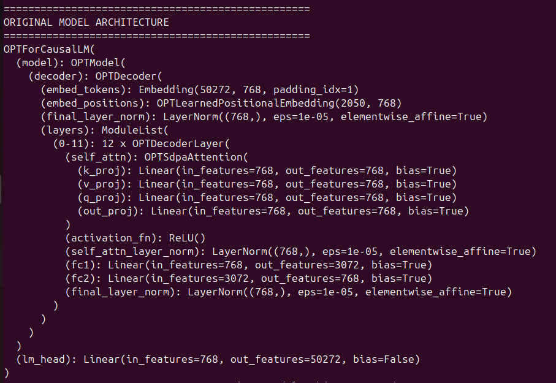
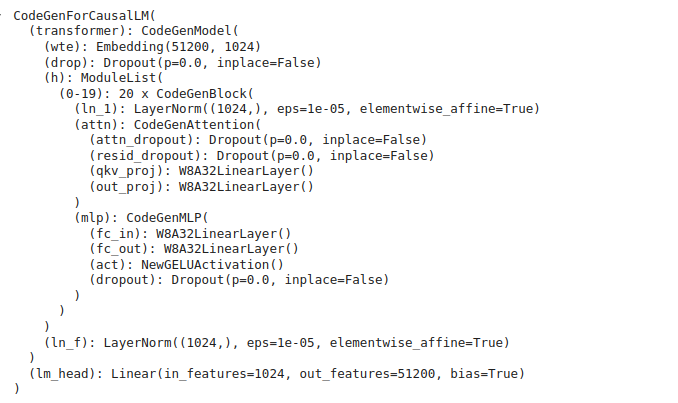

# TinyQ

A lightweight post-training quantization module built on the top of PyTorch's Modules. 

## Key features

- **PTQ Focus**: quantize of all Linear Layers (nn.Linear)
- **Quantization Methods**: `W8A32` (8-bit weights, 32-bit activations), `W8A16` (8-bit weights, 16-bit activations), `W8A8` (Coming soon!)
- **Model Support**: PyTorch models from [Hugging Face Hub](https://huggingface.co/models?library=pytorch)
- **Offline-first approach**: no automatic downloads from the cloud
- **Built-in benchmarking**: latency and memory footprint tracking

## Project Structure 

```
TinyQ/
├── logs/              # Benchmark and training logs
├── models/            # Local model storage
├── tinyq.py           # Core quantization library
├── utils.py           # Utility functions
├── examples.py        # Usage examples
└── bench.py           # Benchmarking tools (Coming soon)
```

## Quick Start

### 1. Installation

> [!NOTE] 
> TinyQ is built with efficiency in mind to be used at the edge (locally) on both CPU and GPU based systems. 

> The [requirements.txt](./requirements.txt) file uses a CUDA-enabled PyTorch. For systems without CUDA, please follow the PyTorch installation [guide](https://pytorch.org/get-started/locally/) to get the correct version.

```bash
git clone https://github.com/afondiel/TinyQ.git
cd TinyQ

# Create and activate conda environment
conda create -n tinyq python>=3.8
conda activate tinyq

# Install requirements
pip install -r requirements.txt
```

### 2. Download a Model

> [!IMPORTANT]
> This current version operates in `offline-mode` only. Please, download a pytorch model from [HF Hub](https://huggingface.co/models?library=pytorch) to start with. You can also use the script below:

```bash
# Example: Download OPT-125M
huggingface-cli download --resume-download facebook/opt-125m --local-dir ./models/facebook/opt-125m
```

See the full [Model Setup Guide](docs/model_setup.md) for detailed instructions.

### 3. Run Quantization

```python
from tinyq import Quantizer
from utils import load_local_hf_model, get_generation

# Load model
model, tokenizer = load_local_hf_model("./models/facebook/opt-125m")

# Initialize quantizer
quantizer = Quantizer(model)

# Quantize model (W8A32 or W8A16)
qmodel = quantizer.quantize(q_method="w8a32")

# Test inference
prompt = "Hello, world!"
result = get_generation(qmodel, tokenizer, prompt)
print(result)
```

## Usage 

### 1. CLI Mode

```bash
python examples.py \
    --model_path "./models/facebook/opt-125m" \
    --qm w8a32 \
    --test_inference \
    --qmodel_path "./qmodel"
```

### 2. Run Performance Benchmarking

```bash
python bench.py \
    --model_path "./models/facebook/opt-125m"
```

## Roadmap

### Current Focus
- [x] W8A32 implementation
- [x] W8A16 implementation
- [ ] Documentation and examples
- [ ] Unit tests

### Core Features
- [ ] W8A8 Quantization Support
- [ ] Model Support Extensions
- [ ] Additional Layer Support
- [ ] Performance Optimization

## Demo

The examples below shows a Pytorch model printout before and after applying W8A32 Quantization.

Before: 



After:



You can also use a tool like [NEUTRON](https://netron.app/) get more in-depth insight and compare both models.

## Benchmark Demo

(Still to Come)

## Contributing 

Contributions are welcome! Please see the [Contributing Guidelines](CONTRIBUTING.md).

## License 

This project is licensed under the MIT License - see the [LICENSE](LICENSE) file for details.

## Acknowledgments

This project started as a learning exercise from the [Quantization Fundamentals](https://www.deeplearning.ai/short-courses/quantization-fundamentals-with-hugging-face/) course by DeepLearning.AI and Hugging Face, helping me understand the core concepts behind model quantization.

Special thanks to:
- Younes Belkada & Marc Sun for their excellent instruction and course content
- Andrew Ng and the DeepLearning.AI team for making AI education accessible and practical
- [kaushikacharya](https://github.com/kaushikacharya) for his detailed course notes that provided valuable guidance

